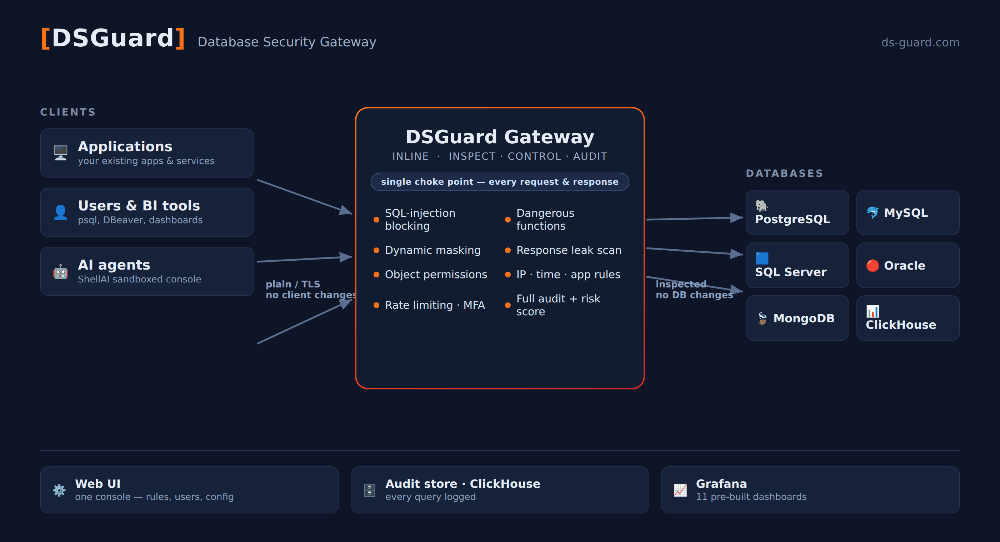

# DSGuard Community

Welcome to the DSGuard community space — the place to report bugs, request features and ask questions.

| | |
|---|---|
| 🐞 | **[Report a bug](../../issues/new?template=bug_report.yml)** |
| 💡 | **[Request a feature](../../issues/new?template=feature_request.yml)** |
| ❓ | **[Ask the community](../../discussions)** |
| 🔒 | **[Report a security vulnerability](../../security/advisories/new)** — private, only the DSGuard team sees it |

---

## About DSGuard



**DSGuard** is a database security gateway. It sits between your applications and your databases and
inspects every request and response in real time, protecting **PostgreSQL, MySQL, MSSQL, Oracle,
MongoDB and ClickHouse** against:

- **SQL injection** — pattern-based detection with per-rule allow / monitor / block actions
- **Dangerous operations** — `DROP`, `xp_cmdshell`, `pg_read_file` and hundreds more, blocked by policy
- **Data leaks** — response scanning for credit cards, PII and secrets before results reach the client
- **Unauthorized access** — object-level permissions, IP filtering, time windows, application filtering,
  rate limits and TOTP multi-factor authentication

Sensitive columns can be masked on the fly (format-preserving, consistent, random or Lua-scripted), and
**every query is audited** with a risk score and the reason for the decision — visible in the web UI and
in 11 pre-built Grafana dashboards.

DSGuard also includes **ShellAI**, a console that runs AI clients (such as coding agents) inside a
sandbox and applies the same class of security rules to what they execute.

All database gateways share one configuration database, one web UI and one audit store.

## Community Edition

The public image is the **Community Edition** — **free, no licence key, no registration, no expiry.**

- **All security features are enabled**, permanently — nothing is feature-gated.
- **Logging and audit are never restricted by licensing.** Your query logs are always yours.
- The only limits are capacity: **3 data sources** and **3 ShellAI users**.

Professional and Enterprise differ from Community **only in capacity and support — never in features**.
For higher capacity, production deployment or licensing, contact **dsg@ds-guard.com**.

## Try it

```bash
docker run -d --name dsguard --network host -v dsguard-data:/data dsguard/dsguard:latest
```

After about 90 seconds (first run), open **https://localhost:8080** (`admin` / `admin`).

> 🐧 The **Community Edition** is supported on **Linux (x86-64)** only — `--network host` is required
> for the gateway to publish its proxy ports, and Docker Desktop for macOS/Windows is not supported.
> (Professional and Enterprise deployments are sized and installed for you; ask us about other
> platforms.)

Full instructions, system requirements and troubleshooting are on the
**[Docker Hub page](https://hub.docker.com/r/dsguard/dsguard)**.

---

## Before you post

- **Never include** passwords, API keys, tokens, connection strings or real customer data. Redact your
  logs before pasting them.
- **Do not report security vulnerabilities in a public issue.** Use the private reporting link above so
  the report stays confidential until a fix is released. See [SECURITY.md](SECURITY.md).
- **Search first** — your question may already be answered in the issues or discussions.
- Tell us the **DSGuard version, database and version, and how you deployed it** — it is usually the
  difference between a quick fix and a long thread.

## Where to ask what

| Topic | Where |
|-------|-------|
| Something is broken | [Bug report](../../issues/new?template=bug_report.yml) |
| Missing capability, an idea | [Feature request](../../issues/new?template=feature_request.yml) |
| How do I configure / deploy X | [Discussions](../../discussions) |
| Security vulnerability | [Private advisory](../../security/advisories/new) |
| Licensing, pricing, commercial support | **dsg@ds-guard.com** |

## Links

- 🌐 **Website** — [ds-guard.com](https://ds-guard.com)
- 🐳 **Docker Hub** — [dsguard/dsguard](https://hub.docker.com/r/dsguard/dsguard)
- 📺 **Video tutorials** — [YouTube playlist](https://www.youtube.com/playlist?list=PL027dW8R0Je1kUwccCWGN6uYyEMV2oYbT)
- 📧 **Commercial enquiries** — dsg@ds-guard.com

---

> **DSGuard is proprietary software.** This repository contains **no source code** — it exists only for
> community feedback, questions and bug reports.
